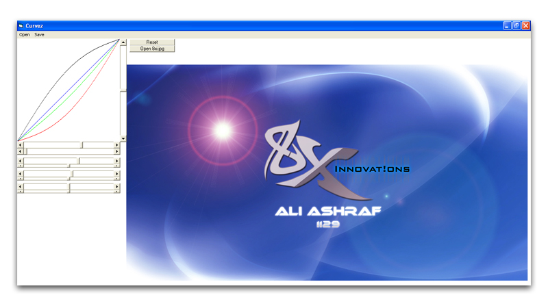



## Geometric Luminance Algorithm

### Description

Change the luminance of any image by next-generation geometric levels method.

Contrary to the common brightness method, this method changes the luminance and RGB values in a better way.

Thanks to Tanner Helland for his FastDrawing class.
 
### More Info
 
Drag mouse pointer over the graph to change its levels. Press Ctrl-Key to use conventional brightness method. Use R, G and B keys to change color values.

             |
---                |---
**Submitted On**   |2008-10-21 17:27:24
**By**             |[Xelon Labs](https://github.com/Planet-Source-Code/PSCIndex/blob/master/ByAuthor/xelon-labs.md)
**Level**          |Intermediate
**User Rating**    |5.0 (20 globes from 4 users)
**Compatibility**  |VB 6\.0
**Category**       |[Graphics](https://github.com/Planet-Source-Code/PSCIndex/blob/master/ByCategory/graphics__1-46.md)
**World**          |[Visual Basic](https://github.com/Planet-Source-Code/PSCIndex/blob/master/ByWorld/visual-basic.md)
**Archive File**   |[Geometric\_2157307112009\.zip](https://github.com/Planet-Source-Code/xelon-labs-geometric-luminance-algorithm__1-72263/archive/master.zip)

